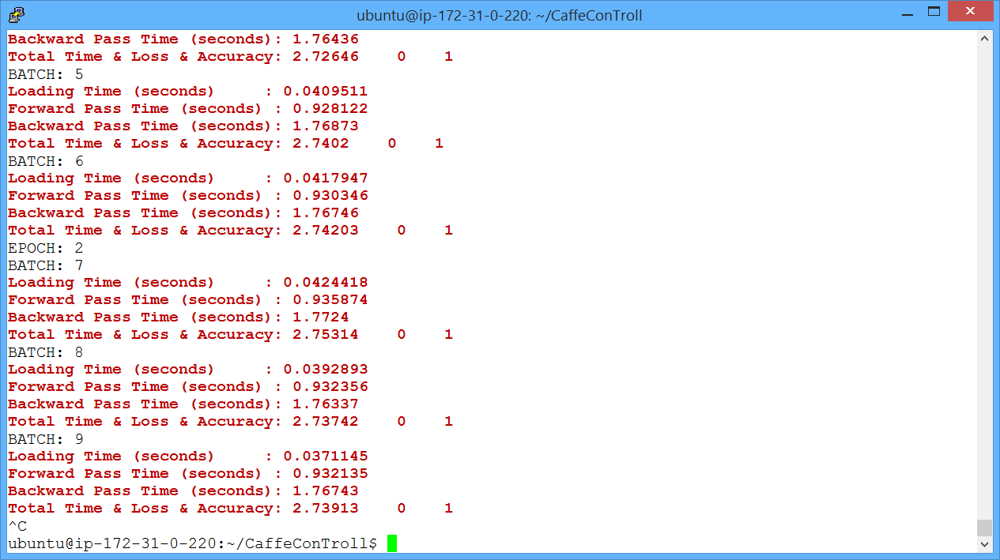
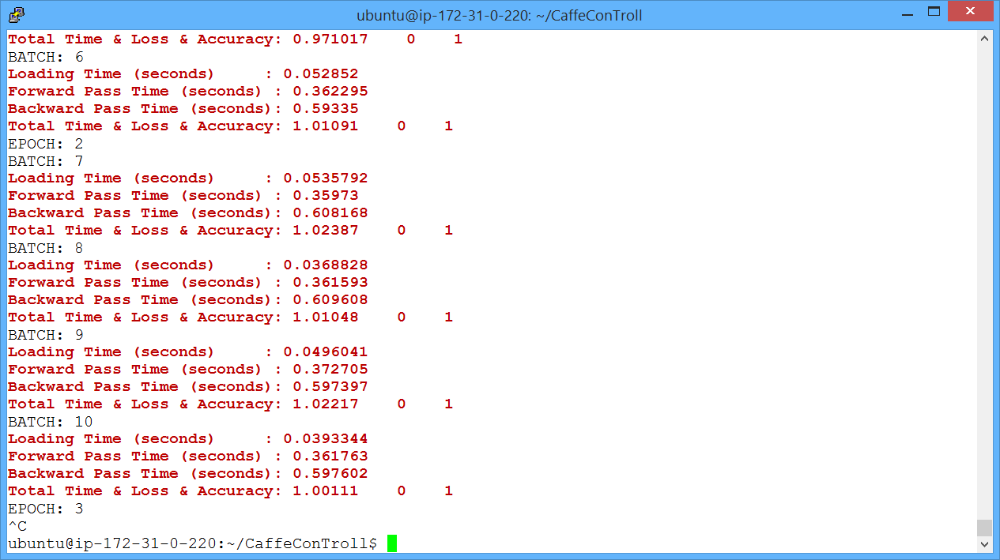
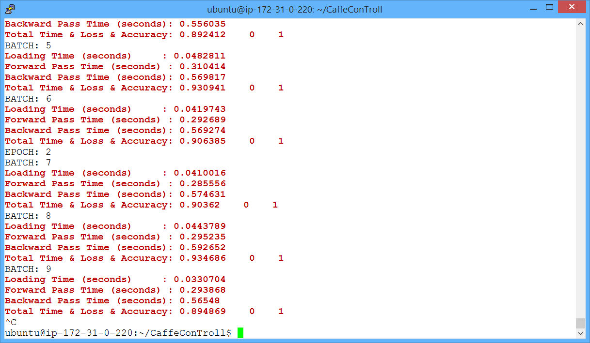

Caffe Con Troll v. 0.1
----------------------

This is an Alpha release of CaffeConTroll. Feedback is welcome!

See our [paper](http://arxiv.org/abs/1504.04343) which will be presented at the 2015 SIGMOD workshop on Data Analytics at Scale (DanaC)

Overview
--------

Caffe con Troll (CcT) is a clone of the uber popular Caffe framework
for Deep Learning. CcT is intended to be compatible with Caffe. We're
academics, which means that CcT is built for a research purpose: *to
explore the relative efficiency of GPUs and CPUs for Deep Learning*.

**Why Study CPU versus GPU?** Well, there is an ongoing debate about
this with lots of passion on both sides! GPU's are wildly [popular
with
some](http://www.wired.com/2015/02/hot-yet-little-known-trend-thatll-supercharge-ai/)
companies that are rumored to be installing purpose-built infrastructures for
deep learning; other
[companies](http://wired.com/2014/07/microsoft-adam/) have opted to
use CPUs and claimed they are cheaper and more efficient. For users
outside the web companies, the situation is different: some cloud
providers don't have GPUs or their GPUs are not as rapidly updated as
their CPUs. In the lab, GPUs can be expensive to obtain.  In contrast,
academic labs like ours have CPUs lying around for other purposes, so
we were curious about how much throughput we could get from CPUs for
Deep Learning. CcT is our first attempt. Our initial results suggest
that our CPU code is almost an order of magnitude more efficient than
Caffe's CPU code. In particular, two 8 core Haswells deliver roughly
80% of the throughput of a highest end GPU (NVidia's Titan). At
current consumer prices, this implies that, chip-to-chip, the CPU
solution costs almost 20% less than a GPU for the same
throughput. These numbers are *incredibly rough* but are fun to think
about (and troll our friends with!)  Our GPU code is also slightly
faster than Caffe, see our [benchmark
page](http://deepdive.stanford.edu/cdw/benchmarking.html). The GPU
speedup is mostly for non-fundamental reasons.

**New Techniques** In the initial version of CcT, CcT's algorithms are
identical to Caffe from a statistical point of view. However, CcT uses
new lowering techniques to speed up convolutions and other layers
inspired by join processing in relational databases. As everyone
agrees, understanding the relational
[join](http://arxiv.org/abs/1310.3314) is the key to understanding the
universe. *Yes, that's just more trolling.* In the near future, we
plan to extend CcT in a few directions:

* Play with our
  [Hogwild!](http://i.stanford.edu/hazy/papers/hogwild-nips.pdf) ideas
  that are used in some of deep learning frameworks.

* Explore the trade-off space described in our [DimmWitted
paper](http://arxiv.org/abs/1403.7550) in the context of Deep
Learning. In particular, we plan to use this framework to study the
trade off between statistical efficiency (*roughly, the number of
steps an algorithm take to converge*) and hardware efficiency
(*roughly, the efficiency of each of those steps*).

* Scale CcT to more than one machine. There are a host of challenges
  to cope with networking issues, delays, and maybe even faults.

* Integrate CcT with [DeepDive](http://deepdive.stanford.edu) to
  hopefully make it easier to build models and use them in
  applications.

Of course, if you have feedback or challenge problems, let us know!

Getting Started AMI
-------------------

Probably the easiest way to try CcT is via a VM. These are publicly
available on AWS and (coming soon!) Azure.

**g2.2xlarge:**  (CCT-0.1-1GPU)  ami-00b5ae68

- Reproduces figure 3a in the [paper](http://arxiv.org/abs/1504.04343)

**c4.4xlarge:**  (CCT-0.1-CPU)   ami-58b1aa30

- Reproduces figure 3b in the [paper](http://arxiv.org/abs/1504.04343)

**g2.8xlarge:**  (CCT-0.1-4GPU)  ami-04b2a96c

- The recently announced EC2 instance with 4 GPUs

Instructions for each AMI are listed in the file 

`/home/ubuntu/AMI_INSTRUCTIONS.txt`

For example, consider the g2.8xlarge AMI, which can be used to run AlexNet
on 4 GPUs. Once the AMI is opened, look at `AMI_INSTRUCTIONS.txt`:

Follow these instructions to load the correct libraries and change to the
`CaffeConTroll` root directory.

Once that is done, run AlexNet on 1 GPU:

> `./caffe-ct train tests/imagenet_train/solver/alexnet_solver_1GPU.prototxt -b tests/imgnet_toprocess.bin -o tests/model.bin`

Argument description: 

- Run the net in "train" mode and specify the path to the solver
- Pass -b (optional) which tells CCT where to write the preprocessed data binary
- Pass -o (optional) which tells CCT where to write the output model binary

Notice that a forwards + backwards iteration, including gradient updates, takes 2.75s.

Next, run with 1 GPU as well as the CPU. The command is the same, except for a different prototxt file which
specifies that the CPU should also be used:

> `./caffe-ct train tests/imagenet_train/solver/alexnet_solver_1GPU_CPU.prototxt -b tests/imgnet_toprocess.bin -o tests/model.bin`

Finally, run with 4 GPUs. Once again the command is the same, except for a different prototxt file which
specifies that 4 GPUs should be used:

> `./caffe-ct train tests/imagenet_train/solver/alexnet_solver_4GPU.prototxt -b tests/imgnet_toprocess.bin -o tests/model.bin`

Notice a > 3x speedup on the current AMI compared to 1 GPU. A speedup of 4x on this 4 GPU instance will be available following
the completion of the model update portion of the distributed CCT project.

Installation from Source
------------------------

We cloned Caffe, so we follow nearly identical [install
instructions](http://caffe.berkeleyvision.org/installation.html).
Start with their instructions! *NB: the .travis.yml should always
contain a working build script for Ubuntu, if you are confused about
dependencies.*

* Step 1. Install the packages listed at the Caffe link.

* Step 2. Clone our repository 

> git clone git@github.com:HazyResearch/CaffeConTroll.git

* Step 3. Copy config.sample to .config and edit .config to contain your paths.

* Step 4. Build the executable `caffe-ct`

> make clean && make -j all

* Step 5. (Optional) If you want tests, you need to install Google's
testing infrastructure, glog and gtest, as with Caffe. Then, make the
test file.

> make test && ./test

It's good on a laptop, on a server, or for a snack. It is unclear
whether CcT can [smell the
blood](http://en.wikipedia.org/wiki/Trollhunter) of christian men.

Partitioning Data for Multiple GPUs
-----------------------------------

Currently CcT allows users to specify the proportion of a layer to run on the GPU using the prototxt attributes:

      gpu_0_batch_proportion
      gpu_1_batch_proportion
      gpu_2_batch_proportion
      gpu_3_batch_proportion

Currently we have attributes for only the first 4 GPUs on the node (as this is most common for a single node) although CcT can support more than 4. 

For example, to run the first convolutional layer of AlexNet on 1 GPU, we add one line to the layer description:

    layers {
      name: "conv1"
      type: CONVOLUTION
      bottom: "data"
      top: "conv1"
      ...
      convolution_param {
        ...
      }
      gpu_0_batch_proportion: 1.0                # New line added
    }

To run on 4 GPUs, partitioning a mini-batch across all 4 GPUs equally,

    layers {
      name: "conv1"
      type: CONVOLUTION
      bottom: "data"
      top: "conv1"
      ...
      convolution_param {
        ...
      }
      gpu_0_batch_proportion: 0.25
      gpu_1_batch_proportion: 0.25
      gpu_2_batch_proportion: 0.25
      gpu_3_batch_proportion: 0.25
    }

The partitions do not need to be equal. To run 40% on the CPU and 60% on GPU 2,

    layers {
      name: "conv1"
      type: CONVOLUTION
      bottom: "data"
      top: "conv1"
      ...
      convolution_param {
        ...
      }
      gpu_2_batch_proportion: 0.6
    }

The default is to run on the CPU, i.e. no modification to the .prototxt file is needed to run the network on the CPU.

For more examples, see the prototxt files in [`tests/imagenet_train/train_val/`](tests/imagenet_train/train_val/)

Known Issues
------------

* If you encounter the OpenBLAS error "Program is Terminated. Because you tried to 
  allocate too many memory regions" then follow the instructions 
  [here](https://github.com/xianyi/OpenBLAS/wiki/faq#allocmorebuffers) to rebuild
  OpenBLAS with more threads. You can also use other libraries, for example BLAS
  and LAPACK are built-in to OS X (see Caffe install instructions).
  
Contact
-------

Send flames to Chris, questions to the current team, Stefan Hadjis, Ce Zhang, and Chris, and praise to past members who built CcT, Firas Abuzaid and Shubham Gupta.
