Caffe Con Troll v. 0.1
----------------------


This is an Alpha release of CaffeConTroll. Feedback is welcome!

See our [paper](http://arxiv.org/abs/1504.04343) and [slides](http://cs.stanford.edu/people/shadjis/CcT_DanaC.pdf) presented the 2015 SIGMOD workshop on Data Analytics at Scale (DanaC)


Table of Contents
-----------------

  * [Overview](#overview)  
  * [Getting Started VM](#getting-started-vm)  
    * [Amazon EC2 g2.8xlarge](#ec2-g28xlarge)  
    * [Amazon EC2 c4.4xlarge](#ec2-c44xlarge)  
    * [Microsoft Azure D-Series](#azure-d-series)  
  * [Installation from Source](#installation-from-source)
  * [Partitioning Data for (Multiple) GPUs](#partitioning-data-for-multiple-gpus)
  * [Known Issues](#known-issues)
  * [Contact](#contact)
  

Overview
--------

Caffe con Troll (CcT) is a clone of the uber popular Caffe framework
for Deep Learning. CcT takes the same input files and produces the same 
outputs as Caffe, but has rebuilt internals. We're
academics, which means that CcT is built for a research purpose: *to
explore the relative efficiency of GPUs and CPUs for Deep Learning*.

**Why Study CPU versus GPU?** Well, there is an ongoing debate about
this with lots of passion on both sides! GPU's are wildly [popular
with
some](http://www.wired.com/2015/02/hot-yet-little-known-trend-thatll-supercharge-ai/)
companies that are rumored to be installing purpose-built infrastructures for
deep learning; other
[companies](http://wired.com/2014/07/microsoft-adam/) have opted to
use CPUs and claimed they are cheaper and more efficient. For users
outside the web companies, the situation is different: some cloud
providers don't have GPUs or their GPUs are not as rapidly updated as
their CPUs. In the lab, GPUs can be expensive to obtain.  In contrast,
academic labs like ours have CPUs lying around for other purposes, so
we were curious about how much throughput we could get from CPUs for
Deep Learning. Our current results show that CcT's CPU code is an order
of magnitude faster than Caffe's CPU code:

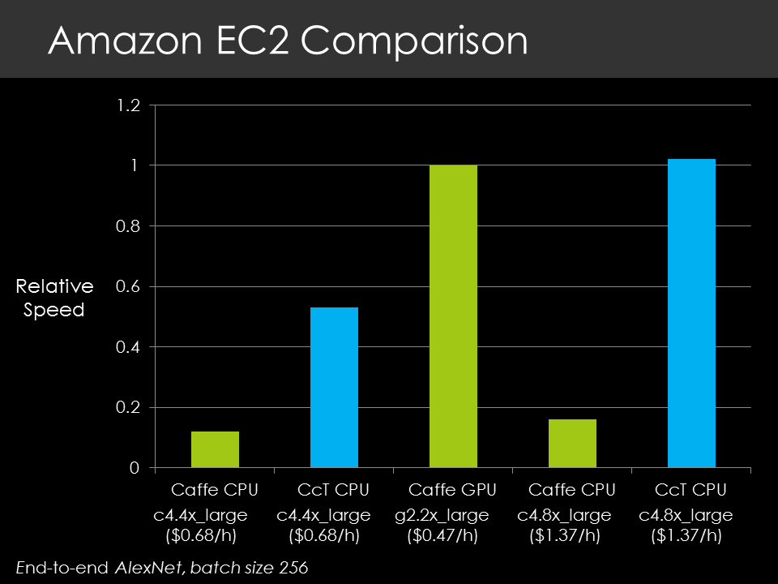

**New Techniques** In the initial version of CcT, CcT's algorithms are
identical to Caffe from a statistical point of view. However, CcT uses
batching, device scheduling and other techniques to speed up end-to-end
network execution time. In the near future, we plan to extend CcT in a 
few directions:

* Play with our
  [Hogwild!](http://i.stanford.edu/hazy/papers/hogwild-nips.pdf) ideas
  that are used in some of the deep learning frameworks.

* Explore the trade-off space described in our [DimmWitted
paper](http://arxiv.org/abs/1403.7550) in the context of Deep
Learning. In particular, we plan to use this framework to study the
trade off between statistical efficiency (*roughly, the number of
steps an algorithm take to converge*) and hardware efficiency
(*roughly, the efficiency of each of those steps*).

* Scale CcT to more than one machine. There are a host of challenges
  to cope with networking issues, delays, and maybe even faults.

* Integrate CcT with [DeepDive](http://deepdive.stanford.edu) to
  hopefully make it easier to build models and use them in
  applications.

Of course, if you have feedback or challenge problems, let us know!

Getting Started VM
------------------

Probably the easiest way to try CcT is via a VM. These are publicly
available on AWS and Azure.

**EC2 g2.2xlarge:**  (CCT-0.1-1GPU)  ami-00b5ae68

- Reproduces figure 3a in the [paper](http://arxiv.org/abs/1504.04343)

**EC2 c4.4xlarge:**  (CCT-0.1-CPU)   ami-58b1aa30

- Reproduces figure 3b in the [paper](http://arxiv.org/abs/1504.04343)

**EC2 g2.8xlarge:**  (CCT-0.1-4GPU)  ami-c75db8ac

- The recently announced EC2 instance with 4 GPUs

Instructions for each AMI are listed in the file 

`/home/ubuntu/AMI_INSTRUCTIONS.txt`

**Azure D-Series:**  (See instructions below)


EC2 g2.8xlarge
--------------

For example, consider the g2.8xlarge AMI, which can be used to run AlexNet
on 4 GPUs.

First, open the EC2 instance: (CCT-0.1-4GPU)  ami-c75db8ac

Once the AMI is opened, look at `AMI_INSTRUCTIONS.txt`:

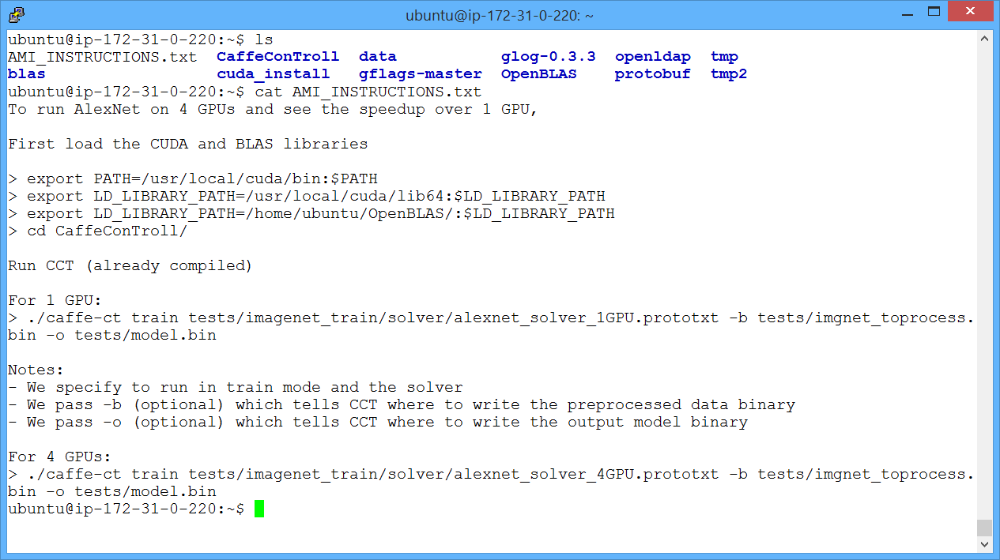

Follow these instructions to load the correct libraries and change to the
`CaffeConTroll` root directory.

Once that is done, run AlexNet on 1 GPU:

> `./caffe-ct train tests/imagenet_train/solver/alexnet_solver_1GPU.prototxt -b tests/imgnet_toprocess.bin -o tests/model.bin`

Argument description: 

- Run the net in "train" mode and specify the path to the solver
- Pass -b (optional) which tells CCT where to write the preprocessed data binary
- Pass -o (optional) which tells CCT where to write the output model binary

Notice that a forwards + backwards iteration, including gradient updates, takes 2.75s.

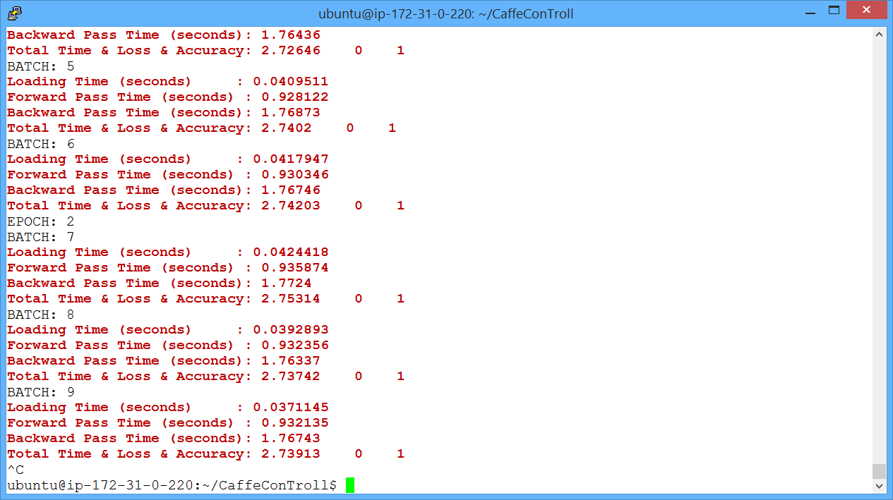

Next, run with 1 GPU as well as the CPU. The command is the same, except for a different prototxt file which
specifies that the CPU should also be used:

> `./caffe-ct train tests/imagenet_train/solver/alexnet_solver_1GPU_CPU.prototxt -b tests/imgnet_toprocess.bin -o tests/model.bin`

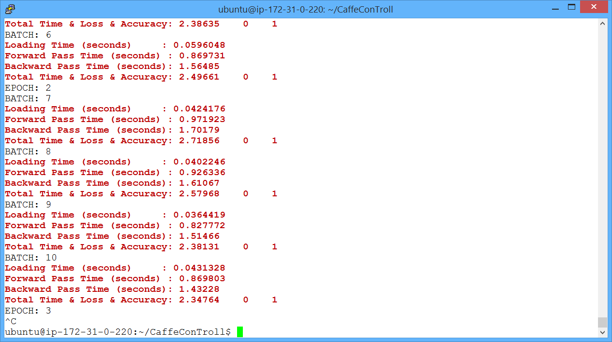

Finally, run with 4 GPUs. Once again the command is the same, except for a different prototxt file which
specifies that 4 GPUs should be used:

> `./caffe-ct train tests/imagenet_train/solver/alexnet_solver_4GPU.prototxt -b tests/imgnet_toprocess.bin -o tests/model.bin`

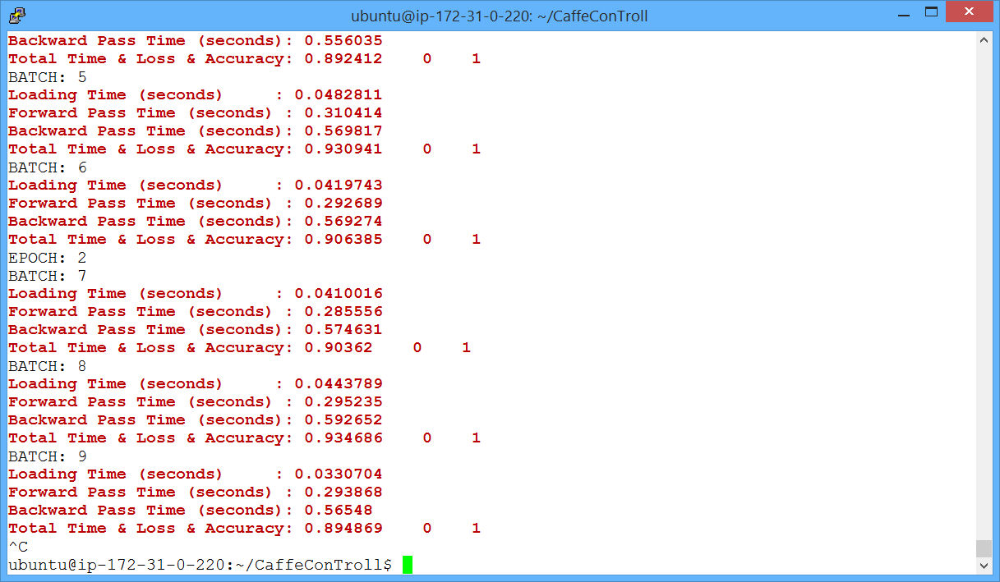

Notice a > 3x speedup on the current AMI compared to 1 GPU. A speedup of 4x on this 4 GPU instance will be available following
the completion of the model update portion of the distributed CCT project.

These results are summarized below:

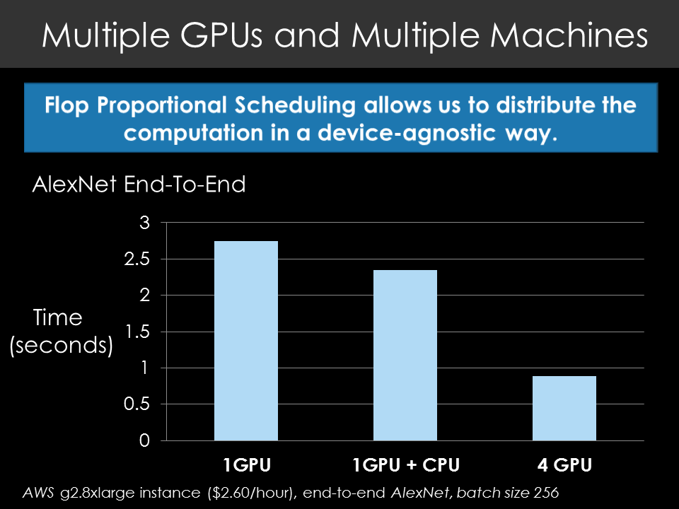

EC2 c4.4xlarge
--------------

To run the c4.4xlarge AMI (or the larger c4.8xlarge EC2 instance):

First, open the EC2 instance: (CCT-0.1-CPU)   ami-58b1aa30

Follow the instructions in 

`/home/ubuntu/AMI_INSTRUCTIONS.txt`

to set the correct library paths.

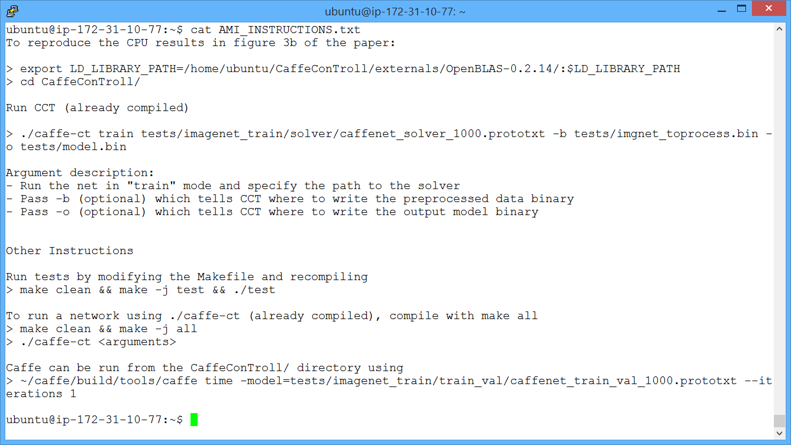

Once this is done, run CcT on CaffeNet:

> `./caffe-ct train tests/imagenet_train/solver/caffenet_solver_1000.prototxt -b tests/imgnet_toprocess.bin -o tests/model.bin`

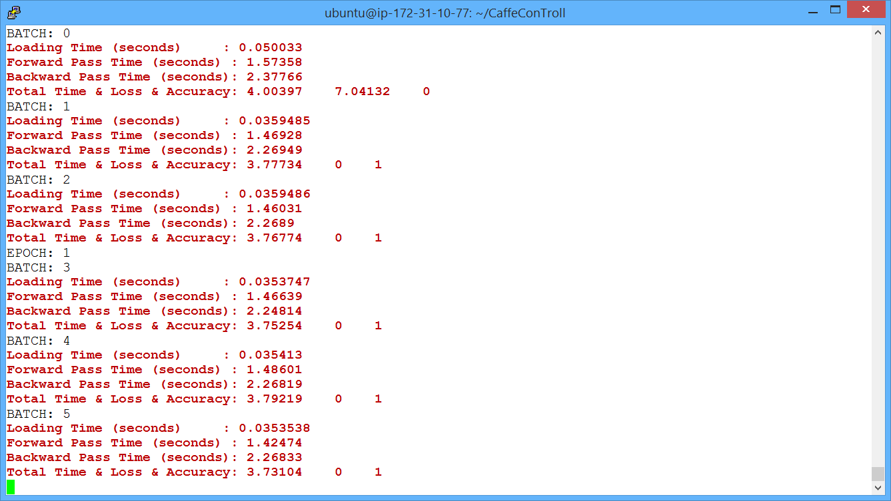

CcT finishes an iteration in 3.8 seconds.

You can also run Caffe on the same prototxt file used by the `caffenet_solver_1000.prototxt` solver:

> `~/caffe/build/tools/caffe time -model=tests/imagenet_train/train_val/caffenet_train_val_1000.prototxt --iterations 1`

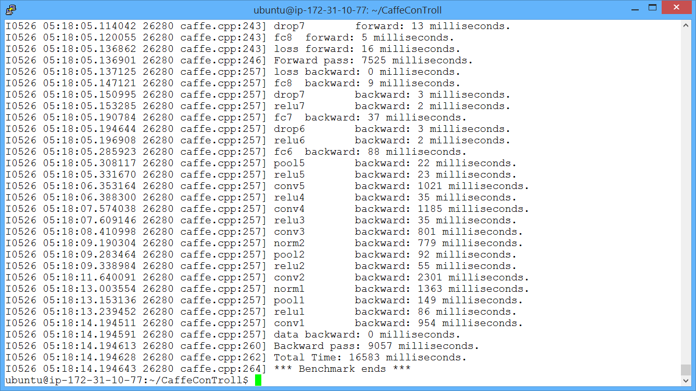

Note that Caffe takes 16.5 seconds per iteration. Note also that Caffe is being run in "time" mode which does not perform gradient updates as part of these 16.5 seconds (CcT does).

CcT partitions each mini-batch into 16 partitions to process in parallel. The impact of batch size is shown below:

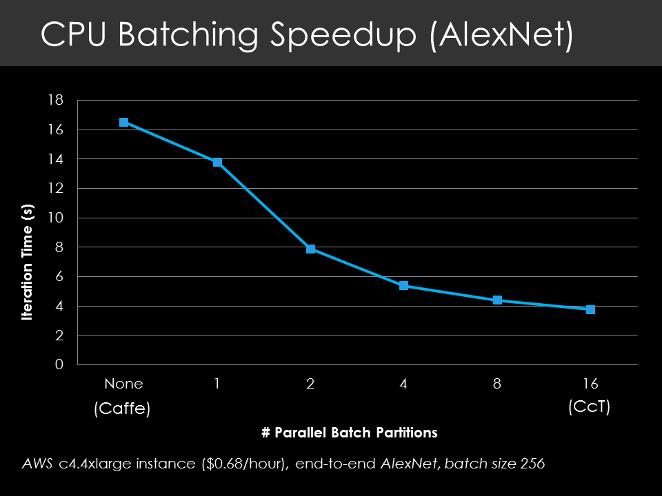

Note: When running this AMI on a different EC2 instance (e.g. running this c4.4xlarge AMI on c4.8xlarge), you may need to recompile OpenBLAS to avoid memory errors:

```cd CaffeConTroll/externals/OpenBLAS-0.2.14/```

``` make clean && make -j```


Azure D-Series
--------------

To run on an Azure Standard D-Series VM (tested on Ubuntu 14.04), open a VM and then download and run
the following [script](docs/VM_Instructions/azure_setup.bash)

> `wget https://raw.githubusercontent.com/HazyResearch/CaffeConTroll/master/docs/VM_Instructions/azure_setup.bash`

> `chmod 777 azure_setup.bash`

> `./azure_setup.bash`

This will install CcT and set the correct library paths for the session.
When opening a new session, follow the instructions [here](docs/VM_Instructions/Azure_Standard_D_Series).

Once this is done, run CcT on CaffeNet:

> `./caffe-ct train tests/imagenet_train/solver/caffenet_solver_1000_azure.prototxt -b tests/imgnet_toprocess.bin -o tests/model.bin`

Result on D4 instance:

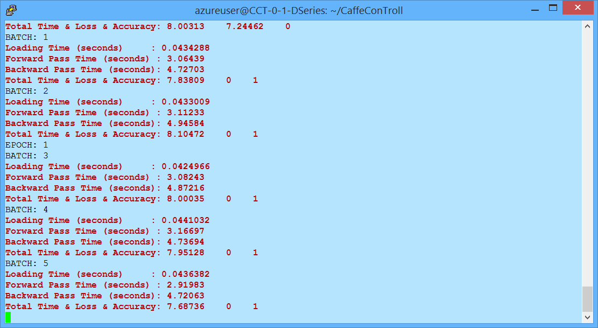

Result on D14 instance:

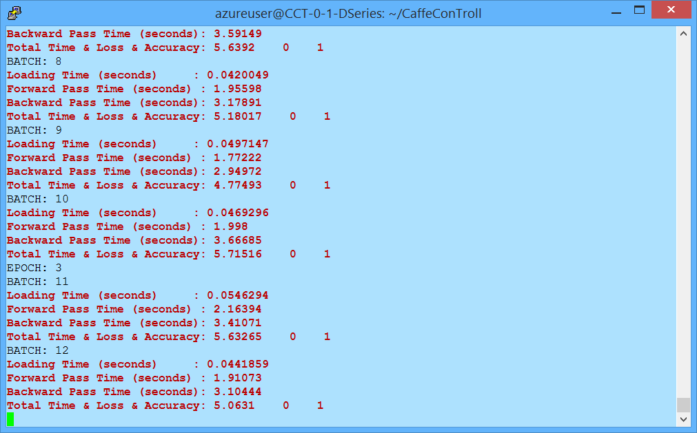

Note: When switching instances for the same VM (e.g. from D4 to D14), you may need to recompile OpenBLAS to avoid memory errors:

```cd CaffeConTroll-master/externals/OpenBLAS-0.2.14/```

``` make clean && make -j```


Installation from Source
------------------------

We cloned Caffe, so we follow nearly identical [install
instructions](http://caffe.berkeleyvision.org/installation.html).
Start with their instructions! *NB: the .travis.yml should always
contain a working build script for Ubuntu, if you are confused about
dependencies.*


* **Step 1.** Install the packages listed at the Caffe link. The dependencies are also listed in .travis.yml.

* **Step 2.** Clone our repository 

> git clone git@github.com:HazyResearch/CaffeConTroll.git

* **Step 3.** Copy config.sample to .config and **edit .config** to contain your paths.

  <h4>Note on BLAS:</h4>

  The BLAS implementation you use can be the same as for Caffe. However, it is currently necessary to modify .config to point to the paths you want to use.

  On OS X we recommend using the default BLAS libraries. BLAS
and LAPACK are built-in to OS X (also see Caffe install instructions from Step 1 above).
For example, this configuration may work inside .config:

  > BLAS\_INCLUDE=/System/Library/Frameworks/Accelerate.framework/Versions/A/Frameworks/vecLib.framework/Versions/A/Headers

  > BLAS\_LIB\_DIR=/System/Library/Frameworks/Accelerate.framework/Versions/A/Frameworks/vecLib.framework/Versions/A

  > BLAS\_LIBS=BLAS LAPACK       # Mac libararies

  > BLAS\_DEFS=-D\_USE\_ATLAS

  On Linux, we currently recommend using OpenBLAS. First, install OpenBLAS from http://www.openblas.net/

     1. Download and unpack the source
     2. `make`
     3. Add the OpenBLAS library to your path, e.g. using the command

  > export LD\_LIBRARY\_PATH=/path/to/OpenBLAS/:$LD\_LIBRARY\_PATH

  Then, fill out the paths inside .config:

  > BLAS\_INCLUDE=/path/to/OpenBLAS

  > BLAS\_LIB\_DIR=/path/to/OpenBLAS

  > BLAS\_LIBS=openblas          # OpenBLAS

  > BLAS\_DEFS=-D\_USE\_OPENBLAS

* **Step 4.** Build the executable `caffe-ct`

> make clean && make -j all

* **Step 5.** (Optional) If you want tests, you need to install Google's
testing infrastructure, glog and gtest, as with Caffe. Then, make the
test file.

> make test && ./test


It's good on a laptop, on a server, or for a snack. It is unclear
whether CcT can [smell the
blood](http://en.wikipedia.org/wiki/Trollhunter) of christian men.


Partitioning Data for (Multiple) GPUs
-------------------------------------

Currently CcT allows users to specify the proportion of a layer to run on the GPU using the prototxt attributes:

      gpu_0_batch_proportion
      gpu_1_batch_proportion
      gpu_2_batch_proportion
      gpu_3_batch_proportion

Currently we have attributes for only the first 4 GPUs on the node (as this is most common for a single node) although CcT can support more than 4. 

For example, to run the first convolutional layer of AlexNet on 1 GPU, we add one line to the layer description:

    layers {
      name: "conv1"
      type: CONVOLUTION
      bottom: "data"
      top: "conv1"
      ...
      convolution_param {
        ...
      }
      gpu_0_batch_proportion: 1.0                # New line added
    }

To run on 4 GPUs, partitioning a mini-batch across all 4 GPUs equally,

    layers {
      name: "conv1"
      type: CONVOLUTION
      bottom: "data"
      top: "conv1"
      ...
      convolution_param {
        ...
      }
      gpu_0_batch_proportion: 0.25
      gpu_1_batch_proportion: 0.25
      gpu_2_batch_proportion: 0.25
      gpu_3_batch_proportion: 0.25
    }

The partitions do not need to be equal. To run 40% on the CPU and 60% on GPU 2,

    layers {
      name: "conv1"
      type: CONVOLUTION
      bottom: "data"
      top: "conv1"
      ...
      convolution_param {
        ...
      }
      gpu_2_batch_proportion: 0.6
    }

The default is to run on the CPU, i.e. no modification to the .prototxt file is needed to run the network on the CPU.

For more examples, see the prototxt files in [`tests/imagenet_train/train_val/`](tests/imagenet_train/train_val/)


Known Issues
------------

* If you encounter the OpenBLAS error "Program is Terminated. Because you tried to 
  allocate too many memory regions" then follow the instructions 
  [here](https://github.com/xianyi/OpenBLAS/wiki/faq#allocmorebuffers) to rebuild
  OpenBLAS with more threads.
  
  If you encounter this error on a VM (e.g. EC2, Azure)
  then first try just recompiling OpenBLAS, as OpenBLAS compiled for one VM may not
  work on another VM. For example on the provided Azure and EC2 instances,

  ```cd CaffeConTroll/externals/OpenBLAS-0.2.14/```

  ``` make clean && make -j```

  You can also use other libraries, for example BLAS
  and LAPACK are built-in to OS X (see Caffe install instructions).
  
Contact
-------

Send flames to Chris, questions to the current team, Stefan Hadjis, Ce Zhang, and Chris, and praise to past members who built CcT, Firas Abuzaid and Shubham Gupta.
